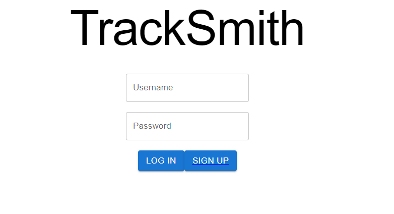
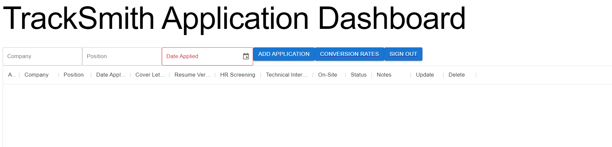
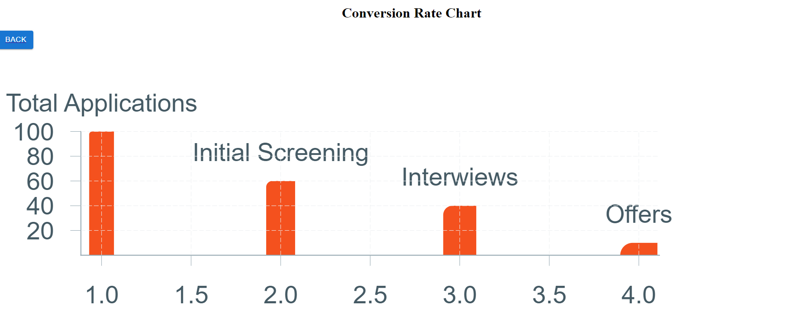

# TrackSmith - Your ticket to ride!!

TrackSmith is a React based application/interview tracking platform that provides utilities to create new applications, track interviews, and view conversion rates through an interactive bar chart. 

 

 

### Features
* Dashboard to view saved applications
* Filters for company, position and status etc.
* Add and Update applications
* View conversion rates

### Built With

- React
- Redux
- React Router
- Node
- Express
- PostgreSQL
- Victory
- Material UI
- React Testing Library,
- Supertest
- Jest

### Authors

- **Abeer Faizan** - [@abeer-f](https://github.com/abeer-f)
- **Jay Wall** - [@hanswand](https://github.com/hanswand)
- **Stephen Kim** - [@stephenkim612](https://github.com/stephenkim612)
- **Kyle Boudewyn** - [@KyleBoudewyn](https://github.com/KyleBoudewyn)

#### License

This project is licensed under the MIT License